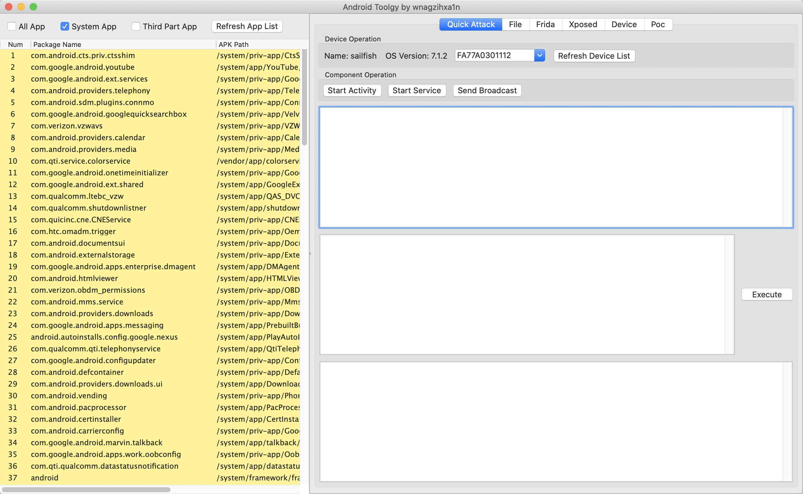

# Toolgy

A useful tool I use in daily analysis work. 

Feel free to open an issue, thank you guys.

## How to Run
Clone the git repo to your computer.
```
git clone https://github.com/wnagzihxa1n/Toolgy.git
```

Open python IDE and import the project, my development tool is PyCharm, it's very powerful.

## How to Build
Create `setup.py`
```
➜  Toolgy git:(master) ✗ py2applet --make-setup MainGUI.py 
```

Edit `setup.py`, here I have already done.
```
"""
This is a setup.py script generated by py2applet

Usage:
    python setup.py py2app
"""
import os

from setuptools import setup

APP = ['MainGUI.py']
APP_NAME = "Android Toolgy"
OPTIONS = {
    'includes': ['wx', 'pubsub', 'subprocess', 'os'],
    'iconfile': 'icon-256x256.icns',
    'plist': {
        'CFBundleName': APP_NAME,
        'CFBundleDisplayName': APP_NAME,
    }
}

BASEDIR = os.path.dirname(os.path.abspath(__file__))
DATA_FILES = ['config.xml', 'icon-256x256.icns']
for root, dirs, files in os.walk(BASEDIR):
    for file in files:
        finalPath = os.path.join(root, file)
        if '__pycache__' in finalPath:
            continue
        if '.idea' in finalPath:
            continue
        if '__init__.py' in finalPath:
            continue
        if finalPath.endswith('.py'):
            DATA_FILES.append(finalPath)

setup(
    app=APP,
    name=APP_NAME,
    data_files=DATA_FILES,
    options={'py2app': OPTIONS},
    setup_requires=['py2app'],
)
```

So, you just need execute the next command and the app file will be created in directory `dist`.
```
➜  Toolgy git:(master) ✗ python setup.py py2app --packages=wx,pubsub,xml
```

## How to Use
First, your system environment needs include `adb`, most of toolgy's functions are base on `adb shell` command.

Please follow the official guide to setup.
- https://developer.android.com/studio/command-line/adb

Once you run it, you will see the window as follow.


Now, We set the adb path. Click the menu `Config->Adb Path`. Just input your adb path and click `OK`.

After doing that, click button `Refresh Device List`, and if you connect your device to computer, you will see the next.



Here are two panels:`packages_panel` and `buttons_panel`.

Connect your device to computer, click the button `Refresh App List`, the list will show all apps installed in your device.

We select one item and click `Start Activity`, toolgy shows very clear description


You could fill the component name and add some params like `--es xxx` whatever you need.

Other buttons are same as `Start Activity`.